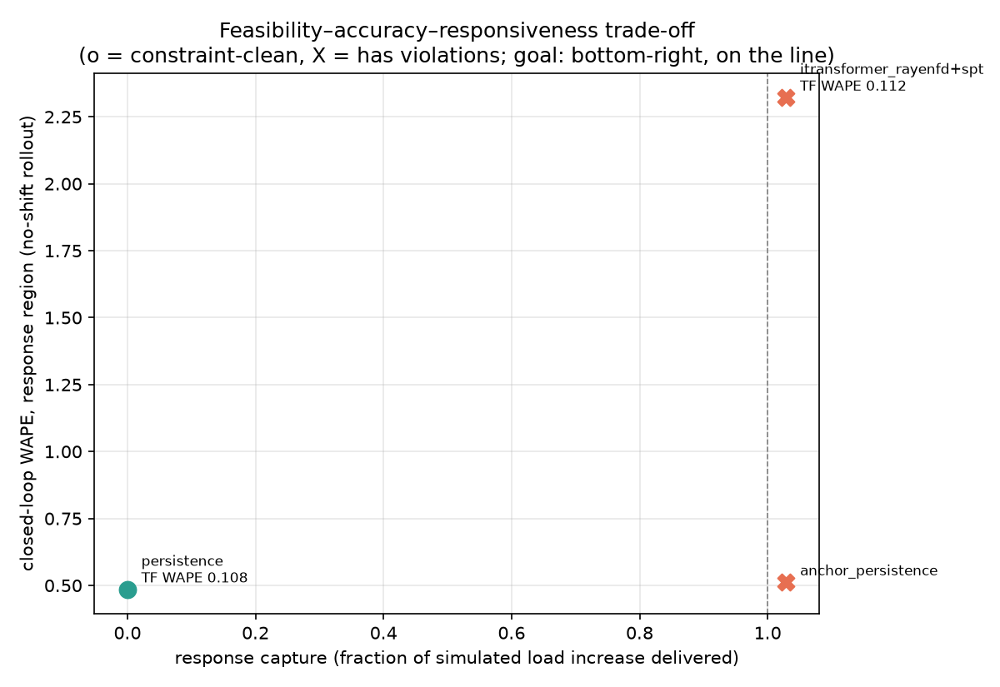

# Bottleneck study — ladder verdicts

Scenario gated on: `increase_g30`. Thresholds: P1 macro +0.005 / channel +0.01 vs persistence; P2 capture 0.8-1.2, track p50 <= 100 MW, 0 free ramps/negs; P3 >= 95.0% days feasible, worst day <= 100%.

| problem | A | B (if A fails) | verdict | detail |
| --- | --- | --- | --- | --- |
| P1 WAPE vs persistence | gas_steam passthrough | retrain rayenfd (passthrough on) | **FAIL -> escalate to B** | macro gap +0.0039 (tol +0.005), worst non-battery channel gap +0.0204 (tol +0.01); battery gap -0.0006 is the accepted irreducible part |
| P2 demand response | pin D=nd(t-1) + scenario nd in free window | retrain rayenfd; C = inference anchor | **PASS -> A suffices** | capture 1.029 (need 0.8-1.2), track p50 91 MW (<= 100), free-window ramps 0, neg 0 |
| P3 battery constraint | per-day SOC as reported diagnostic | stateful closed-loop SOC clip | **FAIL -> escalate to B** | per-day feasible [100.0, 88.7, 0.0]% (need >= 95.0), worst 553.0% of nameplate; whole-window swing is reported for transparency only (drift artifact) |

## Scenario rows (gated tag)

| model | capture | track p50 MW | n_ramp free/seam/tf | n_neg | soc day % |
| --- | --- | --- | --- | --- | --- |
| anchor_persistence | +1.029 | 91 | 387/93/188 | 0 | 99 |
| itransformer_rayenfd+spt | +1.029 | 91 | 0/169/90 | 0 | 89 |
| persistence | +0.000 | 1140 | 0/41/0 | 0 | 100 |

## Response vs g (increase scenario, rayenfd)

| g % | capture | track p50 MW | track p95 MW | n_ramp | soc worst day % |
| --- | --- | --- | --- | --- | --- |
| 5 | +1.029 | 74 | 257 | 185 | 92.4 |
| 10 | +1.029 | 78 | 288 | 180 | 100.8 |
| 20 | +1.029 | 85 | 330 | 170 | 115.8 |
| 30 | +1.029 | 91 | 356 | 259 | 134.0 |

