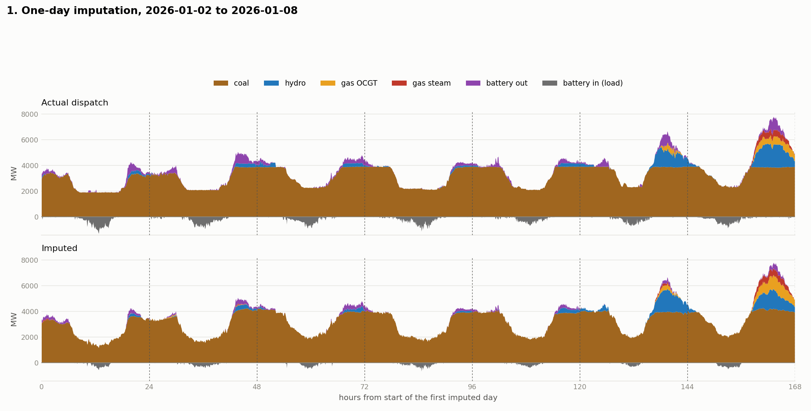
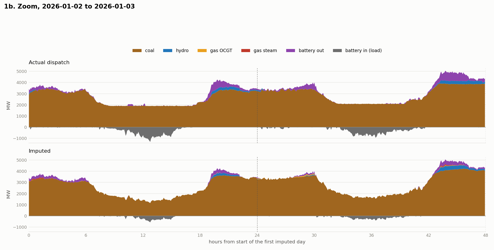
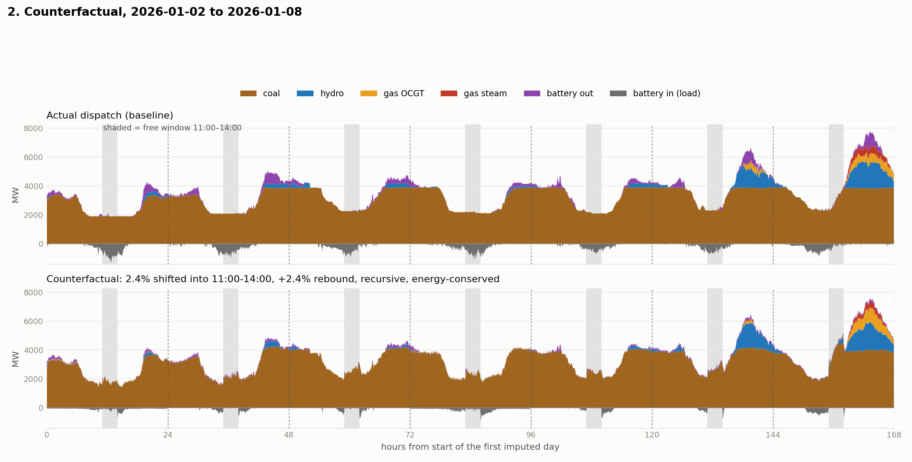
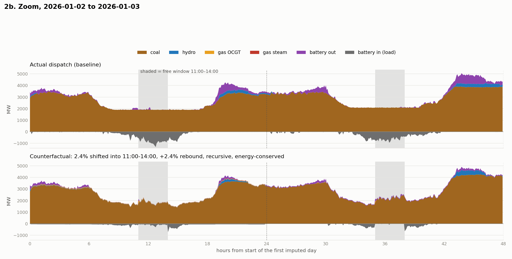

# One-day imputation and counterfactual — `blackout` (BiLSTM + hardnet)

60 consecutive test days from 2026-01-02. SOC reservoir bound carried across days and restarted every 7 days: the actual dispatch needs a 4,891 MWh swing over 60 days against a 4,536 MWh target, so a 60-day chain would declare 41% of real data infeasible; at 7 days the real maximum is 4,062 MWh.

---

## 1. Evaluation — one-day imputation

Teacher-forced. Both sides of the gap are observed, which is what makes this imputation rather than forecasting, so 4 h of real dispatch on each side is the task definition.

### MAE (MW)

| arm | hydro | coal | steam | ocgt | bat_chg | bat_dis | **aggregate** |
| --- | ---: | ---: | ---: | ---: | ---: | ---: | ---: |
| one-day imputation (TF) | 77.1 | 154.5 | 10.0 | 25.0 | 89.2 | 67.7 | **70.6** |

### MRE (%)

| arm | hydro | coal | steam | ocgt | bat_chg | bat_dis | **aggregate** |
| --- | ---: | ---: | ---: | ---: | ---: | ---: | ---: |
| one-day imputation (TF) | 29.3 | 4.6 | 101.4 | 59.6 | 78.3 | 72.7 | |

_MRE is unreliable where the truth is mostly zero; gas steam is >90% zero._



Zoomed to the first 2 days, ticks every 6 h:



---

## 2. Counterfactual — load shift into 11:00-14:00

Recursive. Once demand moves, the dispatch that actually followed no longer applies, so nothing true can be fed back: day 1 runs with no dispatch context at all and each later day takes its left context from its own previous output. The subspace (net demand, demand, wind, solar, price, calendar) stays known throughout.

Scenario definition:

```
outside 11:00-14:00 :  d_new = d * (1 - 0.024)
inside                :  d_new = d * (1 + 0.024) + (MWh removed that day) / n_free
price inside the window forced to $0/MWh

nd_cf = nd_base + (demand_new - demand_old)
```

The 2.4% cut outside the window is MOVED into it, so the day very nearly conserves energy; the 2.4% rebound is the only genuinely induced demand. This is lib/shift_model.py::FixedPercentageShift, the same scenario planB/counterfactual.py uses.

Renewables, curtailment and the interconnector are held fixed, so the whole change falls on the six dispatchable channels. `dispatch_study/midday_response_2026.md` measures the real grid serving about 30% of a midday rise by spilling less, so the dispatchable shares below are inflated relative to reality by roughly that much.

### Energy totals over the window (GWh)

Two runs. **free** is the model left alone. **energy-conserved** adds the constraint that the battery's total net energy over the whole run equals the baseline's, so the counterfactual cannot manufacture or destroy stored energy.

| fuel | baseline | free | change | energy-conserved | change |
| --- | ---: | ---: | ---: | ---: | ---: |
| hydro | 379.1 | 338.0 | -10.9% | 334.3 | -11.8% |
| coal | 4,809.5 | 4,894.8 | +1.8% | 4,870.5 | +1.3% |
| steam | 14.2 | 13.7 | -3.4% | 17.6 | +24.4% |
| ocgt | 60.4 | 38.3 | -36.5% | 41.4 | -31.5% |
| bat_chg | 164.1 | 45.9 | -72.0% | 63.3 | -61.4% |
| bat_dis | 134.1 | 11.8 | -91.2% | 50.1 | -62.6% |

_Battery net energy over 60 days: baseline 2,954 MWh; free 29,070 MWh (drift +26,116, +435 MWh/day); energy-conserved 2,954 MWh (drift -0)._



Zoomed to the first 2 days, ticks every 6 h. The shaded band is the free window:



---

## 3. Constraint violations

| arm | balance max (MW) | steps >1 MW | ramp overshoot (MW) | below zero (MW) | above cap (MW) | SOC swing (MWh) | SOC feasible |
| --- | ---: | ---: | ---: | ---: | ---: | ---: | ---: |
| actual dispatch (reference) | 0.00 | 0.00% | 0.00 | 0.00 | 0.00 | 4,062 | yes |
| imputed (TF) | 0.00 | 0.00% | 0.00 | 0.00 | 0.00 | 3,817 | yes |
| counterfactual (free) | 0.00 | 0.00% | 0.00 | 0.00 | 0.00 | 4,606 | yes |
| counterfactual (energy-conserved) | 0.00 | 0.00% | 0.00 | 0.00 | 0.00 | 2,887 | yes |

_Balance for rows 1-2 is against the real net demand; for the counterfactual it is against the scenario net demand, which is the quantity that run is required to serve. The max is a worst single step -- read it with the `steps >1 MW` column. In the recursive run the seams are the model's own output rather than observed dispatch, so on a few steps the ramp tube between them and the balance plane are incompatible._

_SOC swing is the worst 7-day chain. Pack 4,736 MWh; the projection targets 4,536 MWh after a 100 MWh margin each side._

