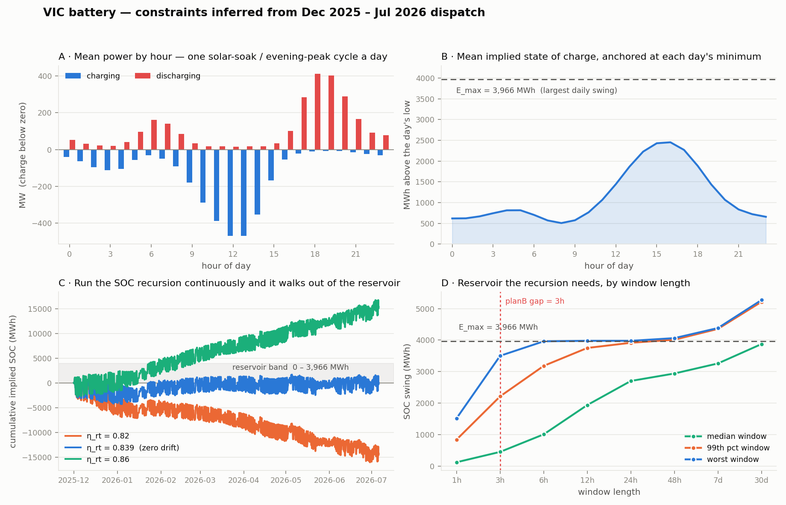

# VIC battery constraints, inferred from 2025–2026 dispatch

What the battery constraint set actually is, derived from
`data/preprocessed/hist/5min/net_dispatch_totdem/table.parquet` rather than from a
registry file. Scripts in this folder reproduce every number.



---

## 1. The window has to be recent, and 2025 is not recent enough

The VIC battery fleet roughly tripled during 2025. Trailing 90-day max discharge:

| month | chg max (MW) | dis max (MW) |
| --- | ---: | ---: |
| 2025-01 | 544 | 445 |
| 2025-05 | 615 | 694 |
| 2025-09 | 1349 | 1285 |
| 2025-12 | **1612** | **1687** |
| 2026-07 | 1360 | 1200 |

A cap fitted on "2025 and 2026" as one block is fitted on three different fleets.
The envelope stops moving at 2025-12; from there to the end of the table
(2026-07-05) the trailing max is flat and nothing new commissions. **Use
2025-12-01 → 2026-07-05, 217 days.** That is what everything below uses.

The earlier half of 2025 is still usable for ramps and efficiency — those are
intensive properties and barely move — but not for caps or reservoir size.

## 2. The constraint set

| # | constraint | value | binding? |
| --- | --- | --- | --- |
| 1 | `0 ≤ chg ≤ P_chg` | 1611.5 MW | rarely — 0.05% of steps within 20% of it |
| 2 | `0 ≤ dis ≤ P_dis` | 1687.4 MW | rarely — 0.03% of steps within 20% of it |
| 3 | `\|Δchg\| ≤ R_chg` | 804.6 MW / 5 min | yes, this is the real limiter |
| 4 | `\|Δdis\| ≤ R_dis` | 649.9 MW / 5 min | yes |
| 5 | `E(t) = E(t−1) + (η·chg − dis/η)·Δt` | η = 0.9160 one-way (η_rt = 0.839) | — |
| 6 | `0 ≤ E(t) ≤ E_max` | 3,966 MWh | at 6h+ horizons; **never at 3h** |
| 7 | ~~`chg · dis = 0`~~ | **do not impose** | see §4 |

Ramps above are the empirical max over the window, matching the `CONSTRAINT.md`
envelope-A convention. The p99.9 equivalents (envelope B) are 413 MW/5min charge
and 366 MW/5min discharge.

## 3. Efficiency is measurable, and it is the thing that pins the reservoir

Charge energy exceeds discharge energy by a stable margin. Over the window,
1,296,899 MWh in against 1,075,382 MWh out. The ratio is the round-trip
efficiency, and it is steady:

- whole window: **0.839**
- monthly range: 0.823 – 0.865 (excluding the 5-day July stub)
- weekly: median 0.836, p10 0.769, p90 0.910

The existing `capacity_constraints.json` value of 0.834 was close and needs no
change. Worth knowing why it works: 0.839 is exactly the value that makes the SOC
recursion drift-free over the window. It is not a nameplate number, it is the
one free parameter fixed by requiring the reservoir to conserve energy.

At a longer accounting period the loss splits into two pieces:

```
monthly:  E_dis = 0.872 · E_chg − 2825 MWh/month     R² = 0.998
weekly:   E_dis = 0.859 · E_chg −  446 MWh/week      R² = 0.888
```

So the marginal round-trip efficiency is ~0.87 and there is a standing loss of
roughly 65–95 MWh/day — auxiliaries and inverter standby on a ~4 GWh fleet, about
2%/day. A single η of 0.839 absorbs both. Splitting them is only worth doing if
you want the model to be right about idle periods specifically.

## 4. Charge and discharge are not mutually exclusive, and you must not make them so

The instinct is to write `chg · dis = 0` or model a single signed power. On
aggregate VIC data that is false:

- both channels above 20 MW on **7.8%** of steps
- the overlap `min(chg, dis)` reaches **455 MW**
- energy inside the overlap is **40,078 MWh = 7.0% of all discharge**

This is not noise. It is fifteen separately-dispatched units: one battery soaking
midday solar while another answers a local FCAS call. Collapsing to a net
`dis − chg` channel discards that 7%, and it also breaks the efficiency
accounting — computed on the net series the round-trip ratio reads 0.829 instead
of 0.839, because netting hides paired flows that each paid their own loss.

Keep two non-negative channels. Constrain them jointly through the SOC recursion,
not through a complementarity condition.

## 5. The reservoir is 3,966 MWh, not 4,735.75 MWh — and only over a bounded window

This is the part that matters most for how you wire the constraint in.

**The nameplate is not the constraint.** Registry says 4,735.75 MWh; the largest
daily swing the fleet has ever produced is 3,966 MWh, 84% of that. Same story on
power — observed max is 73–75% of registered capacity. Registered capacity
includes units that never dispatch to their limit together. Use the observed
figure or the constraint does nothing.

**The recursion cannot be run open-ended.** Panel C is the important one. Run
`E(t) = E(t−1) + (η·chg − dis/η)·Δt` continuously across all 217 days and the
path wanders over a 5,960 MWh range even at the drift-zeroing η — larger than the
reservoir it is supposed to live in. No η fixes this; it is a random walk, because
η is not really constant (weekly 0.72–0.94) and the small per-step error
accumulates. Sweeping η from 0.80 to 0.90 only trades a positive drift for a
negative one:

| η_rt | drift (MWh/day) | path range (MWh) |
| ---: | ---: | ---: |
| 0.82 | −65.9 | 17,089 |
| 0.834 | −17.3 | 6,882 |
| **0.839** | **−0.2** | **5,960** |
| 0.86 | +70.8 | 19,516 |

**So state the constraint over a window with a free initial SOC.** For a window of
length H, `max_t E(t) − min_t E(t) ≤ E_max` — equivalently, run the recursion from
a free `E_0` and require the path to stay in `[0, E_max]`. The required E_max then
depends on H (panel D):

| window | median | p99 | worst |
| --- | ---: | ---: | ---: |
| 1h | 122 | 841 | 1,518 |
| **3h** | **451** | **2,214** | **3,502** |
| 6h | 1,008 | 3,182 | 3,961 |
| 24h | 2,703 | 3,915 | **3,978** |
| 48h | 2,940 | 4,012 | 4,063 |
| 7d | 3,259 | 4,356 | 4,384 |
| 30d | — | 5,216 | 5,273 |

Read it as: at 24h the worst real window needs 3,978 MWh and the curve is flat
there, which is the reservoir showing itself. Past 48h the curve keeps climbing —
that is drift accumulating, not storage. **E_max = 3,966 MWh with a 24h accounting
period, reset daily.** At that setting 100% of rolling 24h windows fit and 0/217
days violate.

## 6. Consequence for planB: at a 3h gap this constraint does nothing

planB imputes a 36-step (3h) gap. The worst 3h swing ever observed is 3,502 MWh,
below E_max = 3,966. With a free initial SOC, **no real 3h window can violate the
energy constraint**, so adding it to the gap head cannot improve a fit against
truth. It only forbids counterfactual output — a full 3h discharge at 1,687 MW
would need 5,061 MWh, and the constraint correctly rejects that.

That gives a clean split:

- **imputation / gap-filling at 3h** — skip the SOC constraint. Caps and ramps are
  the whole envelope. This also explains the earlier "SOC infeasible even for
  actuals" result: that was whole-window drift, not infeasibility.
- **counterfactuals and demand-shift rollouts** — enforce it. These push the
  battery outside observed behaviour, which is exactly where the reservoir binds,
  and it is consistent with `soc=True` having helped there before.
- **anything at 6h or longer** — enforce it, with a per-window free `E_0` and a
  daily reset.

## 7. What the battery actually does, so you can sanity-check a model

One cycle a day, and it is a solar-arbitrage shape, not a peak-shaving shape
(panel A/B). Charging peaks 11:00–14:00 at ~470 MW mean against a mean price of
$14–16/MWh. Discharge peaks 18:00–19:00 at ~410 MW mean against $79/MWh. SOC
bottoms around 08:00 and tops out near 16:00.

Median daily throughput is 2,646 MWh of discharge against a 3,966 MWh reservoir,
so about **0.67 equivalent cycles/day** — the fleet is not energy-limited on a
typical day, which is consistent with the constraint being slack most of the time.
The busiest day moved 5,198 MWh, 1.3 cycles, which is the reminder that E_max
bounds the *swing* and not the daily energy: the reservoir gets reused within a
day, so never write the constraint as a cap on daily throughput.

A model that charges at the evening peak or produces a flat SOC profile is wrong
in a way none of the constraints above will catch.

---

## Reproduce

```bash
python3 quick_findings/vic_battery_constraints/01_fleet_and_envelope.py   # fleet growth, caps, ramps, simultaneity
python3 quick_findings/vic_battery_constraints/02_windows_and_binding.py  # window comparison, is it binding
python3 quick_findings/vic_battery_constraints/03_soc_and_efficiency.py   # eta sweep, drift, loss model
python3 quick_findings/vic_battery_constraints/make_fig.py                # the figure
```
